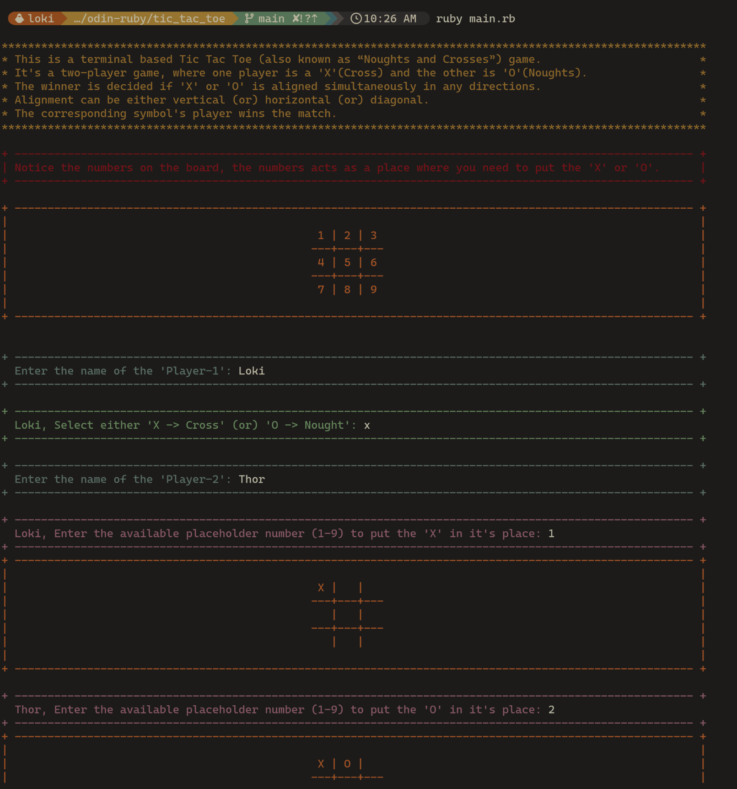
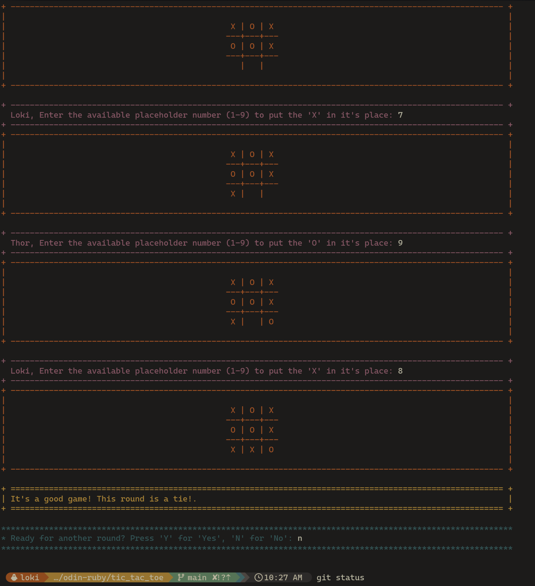
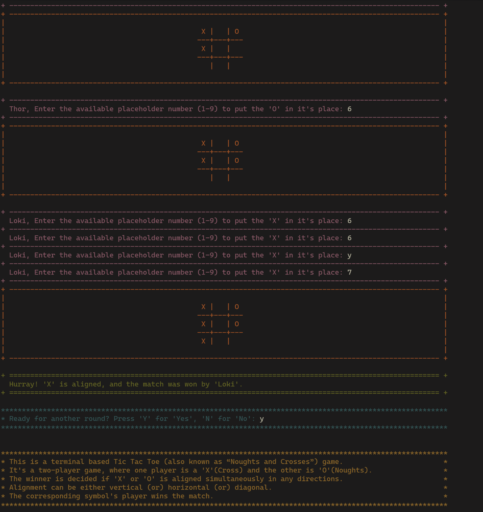

# The Odin Project - Tic Tac Toe

**"Tic Tac Toe"** is also known as **"Noughts and Crosses"** (or) **"Xs and Os"**.

This game is played with two players who take turns marking the spaces in a three-by-three grid with ***'X'*** or ***'O'***.
The player who succeeds in placing three of their marks in a horizontal, vertical, or diagonal row is the winner.

## Objective

To understand how *state* & *behaviour* of the object works and also to get hands-on-experience in writing programs based on `OOP Paradigm`.

One *Class* (or) *Module* per file & organizing multiple files based on the `ruby way`.

## Usage

1. Post running the script, it shows the information about the game & how the board looks & to choose the **position as number from '1' to '9'**.
2. It asks for the name of the **'Player-1'** & to select either ***'X'*** (or) ***'O'***.
3. Prompts to enter the name of the **'Player-2'** & the program itself allots the other character for this player.

4. Enter the **number as position** based on the grid (or) board.
Until the valid position & also the unused position is provided it will keep on asking for the input.
5. If any player wins, *announces the winner* else *declares it as tie*.

6. Finally, it asks for if you want to play another game.

<ins>**NOTE:**</ins> It'll keep on asking for the input if the entered input is ***invalid***.

## Features

- Players can save their names.
- As it's a terminal based game, the messages are neatly formatted for better readability.
- Each messages are assigned with different colors to improve the readability.
